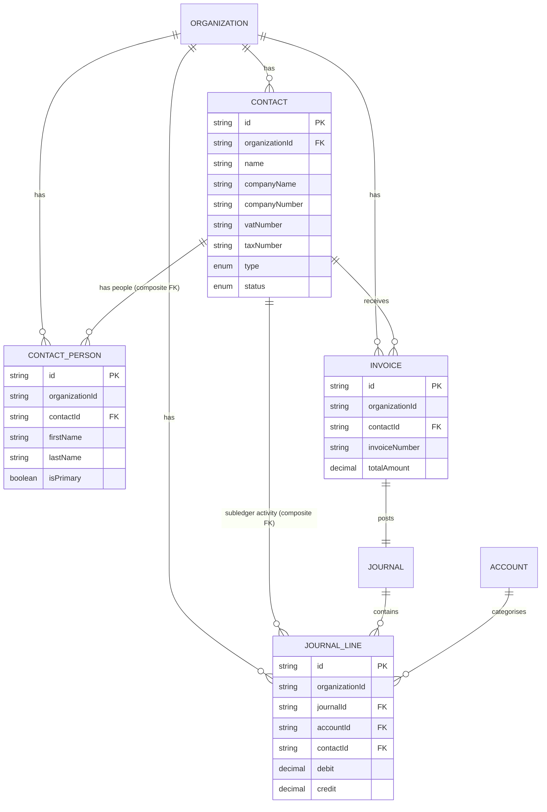

# Entity Relationships: Contacts & Subledger

```mermaid
erDiagram
    ORGANIZATION ||--o{ CONTACT : "has"
    ORGANIZATION ||--o{ CONTACT_PERSON : "has"
    ORGANIZATION ||--o{ JOURNAL_LINE : "has"
    ORGANIZATION ||--o{ INVOICE : "has"

    CONTACT ||--o{ CONTACT_PERSON : "has people (composite FK)"
    CONTACT ||--o{ INVOICE : "receives"
    CONTACT ||--o{ JOURNAL_LINE : "subledger activity (composite FK)"

    INVOICE ||--|| JOURNAL : "posts"
    JOURNAL ||--o{ JOURNAL_LINE : "contains"
    ACCOUNT ||--o{ JOURNAL_LINE : "categorises"

    CONTACT {
        string id PK
        string organizationId FK
        string name
        string companyName
        string companyNumber
        string vatNumber
        string taxNumber
        enum type
        enum status
    }

    CONTACT_PERSON {
        string id PK
        string organizationId
        string contactId FK
        string firstName
        string lastName
        boolean isPrimary
    }

    JOURNAL_LINE {
        string id PK
        string organizationId
        string journalId FK
        string accountId FK
        string contactId FK
        decimal debit
        decimal credit
    }

    INVOICE {
        string id PK
        string organizationId
        string contactId FK
        string invoiceNumber
        decimal totalAmount
    }
```
