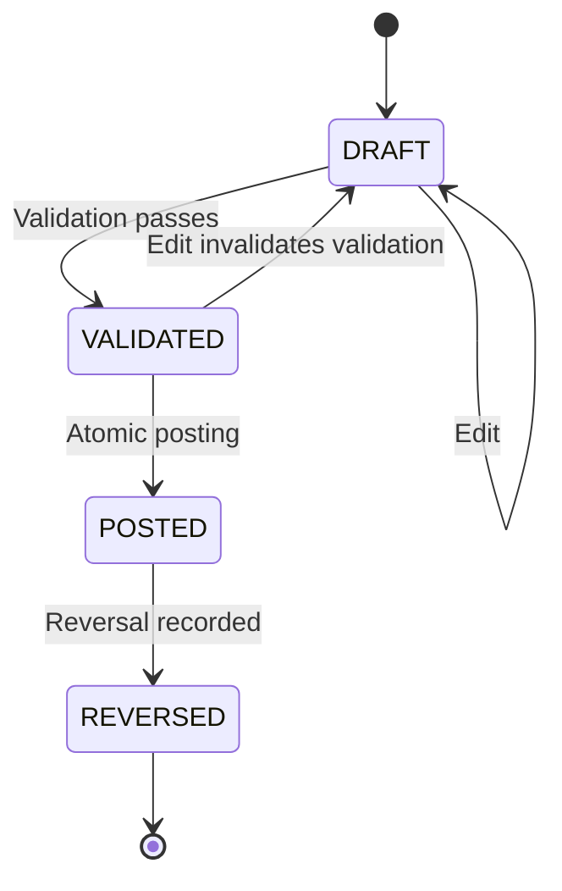

# Journal Lifecycle

## Intended lifecycle

This is the intended conceptual lifecycle. Confirm the actual enum values, permitted transitions, and whether the original posted entry remains POSTED with a separate reversal record. Never infer the production state machine from this diagram alone.

## Validation versus posting
Validation checks whether an entry is eligible to post. It does not itself prove that the ledger has been updated. Posting is a separate, authorised, atomic operation. UI labels and API responses must preserve this distinction.

## Draft editing
Any material change to a validated draft should invalidate prior validation and require validation again. Record the edit in the audit history.

## Posting safeguards
- Recheck permission, organisation state, period state, account eligibility, and balance inside the authoritative transaction.
- Ensure retries or concurrent requests cannot post the same journal twice.
- Commit journal state, ledger effect, sequence/idempotency record, and audit evidence consistently.
- Fail closed when a required check cannot be completed.

## Reversals and corrections
A reversal should be linked to the original entry, preserve history, and produce the intended opposite accounting effect. A replacement entry is a separate action. Specify whether reversals are permitted in the original period or current open period, and what happens when the original period is locked.

## Required tests
- Draft creation and edit.
- Balanced and unbalanced validation.
- Re-validation after edit.
- Posting with insufficient permission.
- Posting into locked periods.
- Concurrent duplicate posting.
- Transaction rollback after simulated failure.
- Reversal linkage, amounts, period handling, and audit history.
- Attempts to mutate or delete posted financial records.
