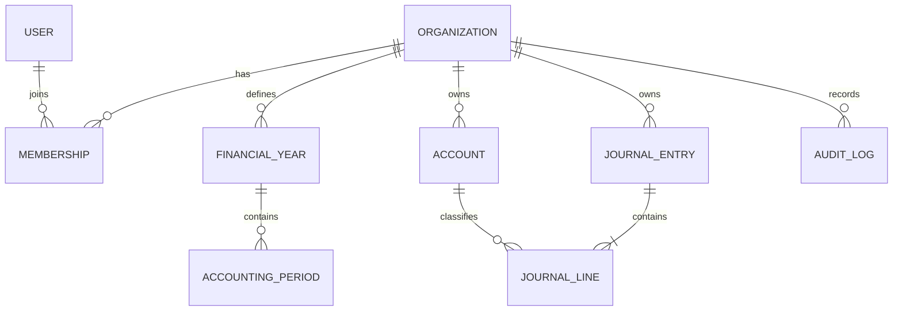

# Data Model and Integrity Principles

## Known domain concepts
The repository README describes organisations, users and sessions, organisation memberships and roles, accounts, financial years, accounting periods, journal entries and lines, audit logs, contacts, sales invoices, purchases, and reports. Confirm exact model names and relations against the current Prisma schema before relying on this list.

## Required integrity principles
- Tenant-owned records carry an organisation context and must be queried through that context.
- Relations between tenant-owned records must not permit cross-organisation references.
- Use stable IDs for relations; account codes should be unique within the intended organisation scope.
- Monetary values use decimal-safe database and application representations. Avoid converting to JavaScript Number for arithmetic.
- Database checks should reject invalid amount combinations where practical.
- Financial-year and period ranges must have explicit inclusive/exclusive boundary semantics and reject overlaps.
- Sequence generation must be atomic under concurrent requests.
- Audit records should identify actor, action, target, timestamp, and safe contextual metadata.
- Migrations are reviewed, versioned, tested against realistic data, and have a recovery plan.

## Entity relationship sketch

This is a conceptual diagram, not an authoritative schema. Add or revise entities only after checking the actual Prisma models.

## Migration checklist
1. Review the schema diff and generated SQL.
2. Identify lock duration, data backfill, uniqueness conflicts, and tenant implications.
3. Test migration from the current supported baseline.
4. Test a rollback or forward-recovery strategy in a disposable environment.
5. Regenerate Prisma Client and run typecheck, tests, and build.
6. Record migration evidence and operational steps.
