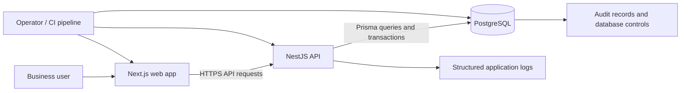

# System Overview

## Current repository structure
The repository is a workspace monorepo with:
- apps/api: NestJS 11 and TypeScript backend; Prisma ORM; PostgreSQL database.
- apps/web: Next.js 15 and React 19 frontend.
- scripts: local database and hosting helpers as described by root package scripts.
- docs: product, architecture, accounting, security, testing, operations, and delivery documentation.

The package manifests list Decimal/Prisma Decimal usage and a database precision target of NUMERIC(19,4) in the README. Verify actual schema precision and every arithmetic path during implementation review.

## Context diagram

## Intended request flow
1. The client sends a request to the API.
2. Authentication identifies the user or session.
3. Organisation context and server-side permission checks authorise the action.
4. Input is validated at the boundary.
5. Domain services enforce accounting and lifecycle rules.
6. Database constraints and transactions protect invariants under concurrency.
7. The result and any audit event are committed consistently.
8. Logs contain a correlation identifier but do not expose secrets or unnecessary personal/financial data.

## Architectural boundaries
- UI validation improves usability but is never the authority for security or accounting rules.
- Controllers handle transport concerns; domain services own business rules.
- Database constraints protect critical invariants against alternate code paths.
- Reports derive from a clearly defined source of posted ledger data.
- Audit history should be append-only and must not be used as a substitute for application security logs.

## Deployment target
A possible future arrangement is a managed PostgreSQL database, a containerised NestJS API, a static/server-rendered Next.js web deployment, a secrets manager, central logs/metrics, and tested backups. AWS is a candidate, not a confirmed deployment decision. Select services only after documenting traffic, residency, cost, recovery, and operational requirements.

## Required follow-up
Create and maintain an Architecture Decision Record (ADR) for material choices. Do not treat this overview as proof that all pictured controls or deployment components are currently implemented.
